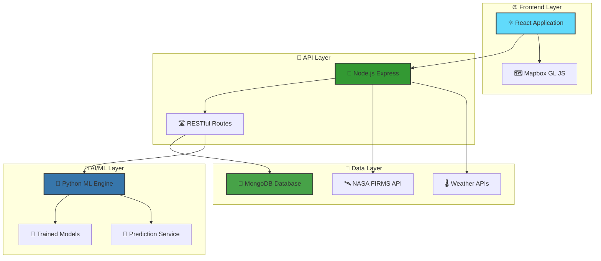

# 🔥 Ignis AI - Fire Prediction System

<div align="center">


[](https://ignis-ai-frontend.onrender.com/)
[](https://www.awesomescreenshot.com/video/39450246?key=5a62c83e79661779a9495f62051fc3ac)
[](https://github.com/MohitPatni0731/Fire-Prediction-system)

<br/>


<br/>

[](https://github.com/MohitPatni0731/Fire-Prediction-system/stargazers)
[](https://github.com/MohitPatni0731/Fire-Prediction-system/network)
[](https://github.com/MohitPatni0731/Fire-Prediction-system/watchers)

</div>

<br/>

<div align="center">
  
</div>

---

## 🌟 Overview

<div align="center">

**Ignis AI** is a cutting-edge fire prediction and visualization system that combines real-time satellite data, advanced machine learning, and interactive mapping to predict wildfire spread patterns. Built with modern web technologies and powered by NASA's FIRMS data, it provides critical insights for fire management and emergency response.


</div>

### ✨ Key Features

<div align="center">

| 🛰️ **Real-time Detection** | 🎯 **AI Predictions** | 🗺️ **Interactive Visualization** | 🌡️ **Weather Integration** |
|:--:|:--:|:--:|:--:|
|  |  |  |  |
| Live satellite integration | Advanced ML models | Dynamic fire markers | Real-time weather data |
| Automated data refresh | Spread probability analysis | Custom visualizations | Wind pattern analysis |
| Fire detection alerts | Environmental factors | Interactive popups | Environmental monitoring |

</div>

<br/>

<div align="center">

```ascii
    🛰️ NASA FIRMS Data → 🔄 Processing → 🤖 AI Analysis → 🗺️ Visualization
         ↓                    ↓              ↓              ↓
    📡 Real-time      →  🗄️ MongoDB   →  🐍 Python ML  →  ⚛️ React UI
```

</div>

---

## 🚀 Quick Start

<div align="center">

### 🎯 Get Started in 3 Easy Steps!

</div>

<details>
<summary>📋 <strong>Step 1: Prerequisites & Requirements</strong></summary>

<br/>

<div align="center">

| Tool | Version | Status | Purpose |
|:----:|:-------:|:------:|:-------:|
| 🟢 **Node.js** | v16.x - v18.x LTS |  | Backend API & Frontend |
| 🐍 **Python** | 3.11+ |  | ML Models & Data Processing |
| 🍃 **MongoDB** | 6.0+ |  | Database Storage |
| 📦 **npm** | v8+ |  | Package Management |
| 🔧 **Git** | Latest |  | Version Control |

</div>

<br/>

### 🔑 API Keys Setup

<div align="center">

| Service | Purpose | Get Your Key | Status |
|:-------:|:-------:|:------------:|:------:|
| 🗺️ **Mapbox** | Map visualization | [](https://www.mapbox.com/) |  |
| 🛰️ **NASA FIRMS** | Fire data | [](https://firms.modaps.eosdis.nasa.gov/) |  |
| 🍃 **MongoDB** | Database | [](https://www.mongodb.com/cloud/atlas) |  |

</div>

</details>

<details>
<summary>📡 <strong>Step 2: Backend Configuration</strong></summary>

<br/>

### 🛠️ Installation Commands

```bash
# 📥 Clone the repository
git clone https://github.com/MohitPatni0731/Fire-Prediction-system.git
cd Fire-Prediction-system

# 📡 Setup Backend
cd backend
npm install
```

### ⚙️ Environment Configuration

Create a `.env` file in the backend directory:

```env
# 🚀 Server Configuration
PORT=5001

# 🗄️ Database
MONGODB_URI=your_mongodb_connection_string

# 🔑 API Keys
NASA_API_KEY=your_nasa_firms_api_key
MAPBOX_ACCESS_TOKEN=your_mapbox_secret_token
```

### 🐍 Python ML Environment

```bash
cd ml
python3 -m venv venv
source venv/bin/activate  # On Windows: venv\Scripts\activate
pip install tensorflow scikit-learn pandas numpy joblib tqdm requests
```

### 🚀 Start Backend Server

```bash
npm start
```

<div align="center">

✅ **Success Indicators:**
- `Server started on port 5001`
- `MongoDB connected successfully`


</div>

</details>

<details>
<summary>🎨 <strong>Step 3: Frontend Configuration</strong></summary>

<br/>

### 🛠️ Installation Commands

```bash
# 🎨 Setup Frontend
cd frontend
npm install
```

### ⚙️ Environment Configuration

Create a `.env` file in the frontend directory:

```env
REACT_APP_MAPBOX_TOKEN=your_mapbox_public_token
REACT_APP_API_BASE_URL=http://localhost:5001/api
```

### 🚀 Start Frontend Application

```bash
npm start
```

<div align="center">

🌐 **Access Application:** http://localhost:3000


</div>

</details>

---

## 🏗️ System Architecture

<div align="center">

### 🎯 High-Level Architecture Overview

</div>



<div align="center">

### 📊 Data Flow Pipeline

</div>

<div align="center">

| Step | Process | Technology | Status |
|:----:|:-------:|:----------:|:------:|
| 1️⃣ | **Data Ingestion** | NASA FIRMS API |  |
| 2️⃣ | **Data Processing** | Node.js + MongoDB |  |
| 3️⃣ | **AI Prediction** | Python + TensorFlow |  |
| 4️⃣ | **Visualization** | React + Mapbox |  |
| 5️⃣ | **User Interface** | Modern Web App |  |

</div>

---

## 🧠 Machine Learning Models

<div align="center">

### 🎯 Dual Model AI Architecture


</div>

<div align="center">

| Model Type | Algorithm | Purpose | Accuracy |
|:----------:|:---------:|:-------:|:--------:|
| 🔍 **Classifier** | Gradient Boosting | Spread Probability |  |
| 📏 **Regressor** | Gradient Boosting | Spread Distance |  |

</div>

### 📈 Feature Engineering

<div align="center">

<table>
<tr>
<td align="center" width="33%">

**🌍 Environmental**
- Elevation Data
- Terrain Analysis  
- Vegetation Index
- Drought Conditions

</td>
<td align="center" width="33%">

**🔥 Fire Characteristics**
- Brightness Values
- Confidence Levels
- Location Coordinates
- Satellite Source

</td>
<td align="center" width="33%">

**🌡️ Weather Conditions**
- Temperature
- Humidity Levels
- Wind Speed
- Wind Direction

</td>
</tr>
</table>

</div>

### 🎨 Prediction Visualization

<div align="center">

| Risk Level | Probability | Visualization | Action |
|:----------:|:-----------:|:-------------:|:------:|
| 🟢 **Low** | < 10% | Minimal indication |  |
| 🟡 **Medium** | 10-20% | Basic visualization |  |
| 🔴 **High** | ≥ 20% | Full spread polygon |  |

</div>

---

## 📁 Project Structure

<div align="center">

### 🗂️ Organized Codebase Architecture

</div>

```
🔥 Fire-Prediction-System/
│
├── 📡 backend/
│   ├── 🧠 ml/                    # Python ML pipeline
│   │   ├── 📊 models/            # Trained ML models (.joblib)
│   │   ├── 🔮 predict_spread.py  # Prediction engine
│   │   ├── 🏋️ train_*.py         # Model training utilities
│   │   └── 📈 process_data.py    # Data preprocessing
│   │
│   ├── 📋 models/                # Database schemas
│   │   ├── 🔥 Wildfire.js        # Fire data model
│   │   ├── 🌡️ Weather.js         # Weather data model
│   │   └── 🗺️ Topography.js      # Terrain data model
│   │
│   ├── 🛣️ routes/                # API endpoints
│   │   ├── 🔥 fireData.js        # Fire data routes
│   │   ├── 🎯 predictSpread.js   # Prediction routes
│   │   └── 🌡️ weather.js         # Weather routes
│   │
│   ├── 🗄️ db.js                 # Database connection
│   └── 🚀 app.js                # Express server
│
├── 🎨 frontend/
│   └── 📱 src/
│       ├── 🗺️ components/        # React components
│       │   ├── 🎛️ MapComponent.jsx  # Interactive map
│       │   ├── 🎚️ FireControls.js   # Control panel
│       │   ├── 📊 Header.js         # Navigation
│       │   └── 🦶 Footer.js         # Footer
│       │
│       ├── 🔌 api.js             # API integration
│       ├── 📊 App.js             # Main application
│       └── 🎨 styles/            # CSS modules
│
└── 📖 README.md                  # This beautiful file!
```

---

## 🎮 Usage Guide

<div align="center">

### 🎯 Master the Fire Prediction Interface


</div>

### 🗺️ Interactive Map Features

<div align="center">

| Feature | Description | Shortcut |
|:-------:|:-----------:|:--------:|
| 🔍 **View Fires** | Active fires as markers | Click markers |
| 📊 **Filter Data** | Brightness & confidence | Control panel |
| 📍 **Location Search** | Find fires near you | Search box |
| 🎯 **Predict Spread** | AI-powered analysis | Fire popup button |

</div>

### 🎛️ Control Panel Tools

<div align="center">

<table>
<tr>
<td align="center">

**🔄 Data Refresh**
- Update with latest fires
- Real-time synchronization
- Auto-refresh options

</td>
<td align="center">

**🎚️ Smart Filters**
- Brightness thresholds
- Confidence levels
- Date range selection

</td>
<td align="center">

**📍 Location Tools**
- GPS integration
- Address search
- Coordinate input

</td>
<td align="center">

**📏 Range Analysis**
- Radius selection
- Distance calculations
- Nearby fire detection

</td>
</tr>
</table>

</div>

---

## 🚨 Important Notices

<div align="center">

### ⚠️ Deployment Information

</div>

> **🔄 Render Free Tier Notice**
> 
> Our live demo uses Render's free tier, which may experience:
> - 🕒 **Cold Start Delays** - Initial load: 10-30 seconds
> - 💤 **Sleep Mode** - Auto-sleep after 15 minutes
> - 🔄 **Auto-Wake** - Automatic restart on new requests

> **🎯 ML Performance Notice**
> 
> Fire spread predictions require:
> - 🧠 **AI Processing Time** - Model inference: 2-5 seconds
> - 🌡️ **Weather Data Fetching** - Real-time API calls
> - 📊 **Result Generation** - Automatic display after completion

---

## 🔧 Development & Deployment

### 🧪 Testing Suite

<div align="center">

| Test Type | Command | Coverage |
|:---------:|:-------:|:--------:|
| 🧪 **Backend** | `cd backend && npm test` |  |
| 🎨 **Frontend** | `cd frontend && npm test` |  |
| 🤖 **ML Models** | `cd backend/ml && python test_models.py` |  |

</div>

### 🏋️ Model Retraining

```bash
# 🧠 Advanced Model Retraining Pipeline
cd backend/ml
source venv/bin/activate

# 📊 Data Processing
python process_data_dual.py       # Extract & engineer features

# 🎯 Model Training
python train_classifier_advanced.py  # Train spread classifier
python train_regressor_advanced.py   # Train distance regressor

# ✅ Model Validation
python validate_models.py         # Test model performance
```

### 🐳 Docker Deployment

<div align="center">

#### 🚀 One-Command Deployment

</div>

```bash
# 🐳 Docker Build & Deploy
docker build -t ignis-ai .
docker run -p 5001:5001 -p 3000:3000 ignis-ai

# 🎯 Docker Compose (Recommended)
docker-compose up -d
```

<div align="center">


</div>

---

## 🤝 Contributing

<div align="center">

### 🌟 Join Our Mission to Fight Wildfires!


</div>

We welcome contributions from developers, data scientists, and fire safety experts! 

<div align="center">

| Step | Action | Description |
|:----:|:------:|:-----------:|
| 1️⃣ |  | Fork this repository |
| 2️⃣ |  | Create feature branch |
| 3️⃣ |  | Make your changes |
| 4️⃣ |  | Run all tests |
| 5️⃣ |  | Submit your PR |

</div>

### 🎯 Contribution Areas

<div align="center">

<table>
<tr>
<td align="center">

**🤖 AI/ML**
- Model improvements
- New algorithms
- Performance optimization

</td>
<td align="center">

**🎨 Frontend**
- UI/UX enhancements
- New visualizations
- Mobile responsiveness

</td>
<td align="center">

**📡 Backend**
- API enhancements
- Database optimization
- Real-time features

</td>
<td align="center">

**📖 Documentation**
- Code documentation
- User guides
- API documentation

</td>
</tr>
</table>

</div>

---

## 📄 License & Legal

<div align="center">

[](https://opensource.org/licenses/MIT)
[](CODE_OF_CONDUCT.md)

This project is licensed under the **MIT License** - see the [LICENSE](LICENSE) file for details.

</div>

---

## 🙏 Acknowledgments & Credits

<div align="center">

### 🏆 Powered by Amazing Technologies

</div>

<div align="center">

| Organization | Contribution | Link |
|:------------:|:------------:|:----:|
| 🛰️ **NASA FIRMS** | Fire data provision | [](https://firms.modaps.eosdis.nasa.gov/) |
| 🗺️ **Mapbox** | Mapping services | [](https://www.mapbox.com/) |
| 🌡️ **NOAA** | Weather data | [](https://www.noaa.gov/) |
| 🧠 **TensorFlow** | ML framework | [](https://tensorflow.org/) |
| ⚛️ **React** | Frontend framework | [](https://reactjs.org/) |

</div>

### 🌟 Special Thanks

<div align="center">

- **🔥 Fire Safety Organizations** - For inspiration and domain expertise
- **👨‍💻 Open Source Community** - For incredible tools and libraries  
- **🌍 Environmental Agencies** - For critical data access
- **👥 Beta Testers** - For valuable feedback and testing

</div>

---

<div align="center">

### 🔥 Ready to Predict and Prevent Wildfires?


<br/>

[](https://github.com/MohitPatni0731/Fire-Prediction-system.git)
[](https://github.com/MohitPatni0731/Fire-Prediction-system/issues)
[](https://github.com/MohitPatni0731/Fire-Prediction-system)

<br/>

**Made with ❤️ and 🔥 for wildfire prevention and safety**

*"Together, we can predict, prevent, and protect against wildfires"*


</div>


