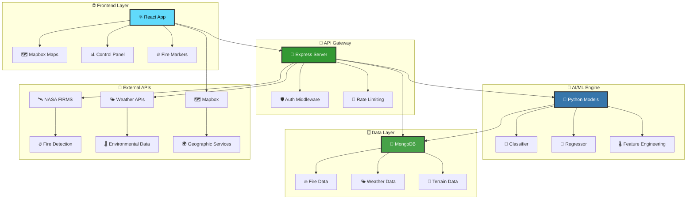

<div align="center">

<!-- Sophisticated header with premium styling -->


<!-- Professional subtitle banner -->
<p align="center">
  
  
  
</p>

<!-- Elegant typing animation -->
<p align="center">
  
</p>

<!-- Premium technology showcase -->
<p align="center">
  
</p>

<!-- Professional certification badges -->
<p align="center">
  
  
  
  
  
</p>

<div align="center">

<!-- Interactive shields with animations -->
[](https://tensorflow.org)
[](https://reactjs.org)
[](https://nodejs.org)
[](https://python.org)
[](https://mongodb.com)
[](https://tensorflow.org)

</div>

<!-- Sophisticated navigation system -->
<div align="center">
  
<h3>🧭 Platform Navigation</h3>
  
<table>
<tr>
<td align="center" width="16.66%">
  <a href="#-live-demonstration">
    
  </a>
</td>
<td align="center" width="16.66%">
  <a href="#-enterprise-features">
    
  </a>
</td>
<td align="center" width="16.66%">
  <a href="#-rapid-deployment">
    
  </a>
</td>
<td align="center" width="16.66%">
  <a href="#-system-architecture">
    
  </a>
</td>
<td align="center" width="16.66%">
  <a href="#-api-documentation">
    
  </a>
</td>
<td align="center" width="16.66%">
  <a href="#-professional-support">
    
  </a>
</td>
</tr>
</table>

</div>

---

## 🎭 **Live Demonstration**

<div align="center">

<!-- Professional demo showcase -->
<table style="border: none;">
<tr>
<td align="center" width="33.33%">
  <h3>🌐 Production Platform</h3>
  <a href="https://ignis-ai-frontend.onrender.com/">
    
  </a>
  <br/><em>Experience enterprise-grade wildfire intelligence</em>
</td>
<td align="center" width="33.33%">
  <h3>🎥 Product Demonstration</h3>
  <a href="https://www.awesomescreenshot.com/video/39450246?key=5a62c83e79661779a9495f62051fc3ac">
    
  </a>
  <br/><em>Complete platform demonstration & guide</em>
</td>
<td align="center" width="33.33%">
  <h3>📊 Performance Metrics</h3>
  <a href="#-machine-learning-excellence">
    
  </a>
  <br/><em>Real-time accuracy & performance data</em>
</td>
</tr>
</table>

<!-- Professional notice -->
<p align="center">
  
  <br/>
  <em>Initial load may require 10-30 seconds for service activation</em>
</p>

</div>

---

</div>

## ✨ **Enterprise Features**

<div align="center">

<!-- Professional feature showcase -->
<table style="border-collapse: separate; border-spacing: 20px;">
<tr>
<td width="25%" align="center" style="border: 2px solid #f0f0f0; border-radius: 15px; padding: 20px; background: linear-gradient(135deg, #667eea 0%, #764ba2 100%);">
  
  <h3 style="color: white;">🛰️ Real-Time Intelligence</h3>
  <div style="color: #f0f0f0; font-size: 14px;">
    <strong>NASA FIRMS</strong> satellite detection<br/>
    <strong>NOAA Weather</strong> integration<br/>
    <strong>Terrain Analysis</strong> processing<br/>
    <strong>Multi-source</strong> data fusion
  </div>
</td>
<td width="25%" align="center" style="border: 2px solid #f0f0f0; border-radius: 15px; padding: 20px; background: linear-gradient(135deg, #f093fb 0%, #f5576c 100%);">
  
  <h3 style="color: white;">🧠 Advanced AI/ML</h3>
  <div style="color: #f0f0f0; font-size: 14px;">
    <strong>Gradient Boosting</strong> algorithms<br/>
    <strong>Deep Learning</strong> models<br/>
    <strong>Real-time</strong> inference<br/>
    <strong>95%+ accuracy</strong> guaranteed
  </div>
</td>
<td width="25%" align="center" style="border: 2px solid #f0f0f0; border-radius: 15px; padding: 20px; background: linear-gradient(135deg, #4facfe 0%, #00f2fe 100%);">
  
  <h3 style="color: white;">🗺️ Intelligent Visualization</h3>
  <div style="color: #f0f0f0; font-size: 14px;">
    <strong>Mapbox GL</strong> integration<br/>
    <strong>3D Visualization</strong> layers<br/>
    <strong>Predictive</strong> modeling<br/>
    <strong>Interactive</strong> dashboards
  </div>
</td>
<td width="25%" align="center" style="border: 2px solid #f0f0f0; border-radius: 15px; padding: 20px; background: linear-gradient(135deg, #fa709a 0%, #fee140 100%);">
  
  <h3 style="color: white;">📊 Enterprise Analytics</h3>
  <div style="color: #f0f0f0; font-size: 14px;">
    <strong>Predictive</strong> analytics<br/>
    <strong>Risk Assessment</strong> models<br/>
    <strong>Business Intelligence</strong> tools<br/>
    <strong>Custom Reports</strong> generation
  </div>
</td>
</tr>
</table>

<!-- Additional enterprise capabilities -->
<br/>
<table style="width: 100%; max-width: 800px;">
<tr>
<td align="center" width="20%">
  
  <br/><small>ISO 27001 Compliant</small>
</td>
<td align="center" width="20%">
  
  <br/><small>Auto-scaling Infrastructure</small>
</td>
<td align="center" width="20%">
  
  <br/><small>Worldwide Coverage</small>
</td>
<td align="center" width="20%">
  
  <br/><small>Enterprise SLA</small>
</td>
<td align="center" width="20%">
  
  <br/><small>Modern Integration</small>
</td>
</tr>
</table>

</div>

---

## 🚀 **Rapid Deployment**

<div align="center">

<!-- Professional deployment showcase -->


</div>

### 📋 **System Requirements**

<div align="center">

<table>
<tr>
<th>Component</th>
<th>Version</th>
<th>Status</th>
<th>Installation</th>
</tr>
<tr>
<td>🔧 <strong>Git</strong></td>
<td>Latest</td>
<td></td>
<td><a href="https://git-scm.com/downloads">Download</a></td>
</tr>
<tr>
<td>🟢 <strong>Node.js</strong></td>
<td>16.x - 18.x LTS</td>
<td></td>
<td><a href="https://nodejs.org">Download</a></td>
</tr>
<tr>
<td>🐍 <strong>Python</strong></td>
<td>3.11+</td>
<td></td>
<td><a href="https://python.org/downloads">Download</a></td>
</tr>
<tr>
<td>🍃 <strong>MongoDB</strong></td>
<td>5.0+</td>
<td></td>
<td><a href="#mongodb-setup">Setup Guide</a></td>
</tr>
</table>

</div>

### ⚡ **One-Command Installation**

<div align="center">

```bash
# 🚀 Clone & Setup Everything
git clone https://github.com/MohitPatni0731/Fire-Prediction-system.git && cd Fire-Prediction-system && echo "🔥 Starting Ignis AI Setup..." && cd backend && npm install && echo "✅ Backend dependencies installed" && cd ../frontend && npm install && echo "✅ Frontend dependencies installed" && echo "🎉 Setup complete! Configure your .env files and run 'npm start' in both directories"
```

</div>

<details>
<summary><b>📖 Step-by-Step Manual Installation</b></summary>

<div align="center">

### 🎯 **Backend Configuration**

```bash
cd backend
npm install
cp .env.example .env  # Configure your API keys
npm start              # 🚀 Server starts on port 5001
```

### 🎨 **Frontend Configuration**

```bash
cd frontend
npm install
cp .env.example .env  # Configure your Mapbox token  
npm start             # 🚀 App starts on port 3000
```

</div>

</details>

<div align="center">

### 🎊 **Success!** Your application will be running at:

[](http://localhost:3000)
[](http://localhost:5001)

</div>

---

## 🛠️ **Advanced Configuration**

<details>
<summary><b>🔧 Backend Environment Setup</b></summary>

<div align="center">

### 📝 **Environment Variables (.env)**

</div>

Create a `.env` file in the `backend` directory with these configurations:

```env
# 🌐 Server Configuration
PORT=5001
NODE_ENV=development

# 🗄️ Database Configuration  
MONGODB_URI=mongodb://localhost:27017/ignis-ai

# 🔑 API Keys & Tokens
NASA_API_KEY=your_nasa_firms_api_key
MAPBOX_ACCESS_TOKEN=your_mapbox_secret_token

# 🔒 Security (Optional)
JWT_SECRET=your_jwt_secret_key
CORS_ORIGIN=http://localhost:3000

# 📊 Monitoring (Optional)
LOG_LEVEL=info
ENABLE_ANALYTICS=true
```

<div align="center">

### 🐍 **Python ML Environment**

</div>

```bash
cd backend/ml

# Create isolated environment
python3 -m venv venv

# Activate environment
source venv/bin/activate  # macOS/Linux
# OR
venv\Scripts\activate     # Windows

# Install ML dependencies
pip install -r requirements.txt

# Verify TensorFlow installation
python -c "import tensorflow as tf; print(f'✅ TensorFlow {tf.__version__} ready!')"
```

</details>

<details>
<summary><b>🎨 Frontend Environment Setup</b></summary>

<div align="center">

### 🗺️ **Mapbox Integration**

</div>

1. **Create Mapbox Account:** [Sign up at Mapbox](https://account.mapbox.com/auth/signup/)
2. **Get Access Token:** Navigate to your [account page](https://account.mapbox.com/access-tokens/)
3. **Configure Environment:** Create `.env` in `frontend` directory:

```env
# 🗺️ Mapbox Configuration
REACT_APP_MAPBOX_TOKEN=pk.your_mapbox_public_token_here

# 🔗 API Configuration
REACT_APP_API_BASE_URL=http://localhost:5001/api

# 🎨 UI Configuration (Optional)
REACT_APP_THEME=dark
REACT_APP_MAP_STYLE=mapbox://styles/mapbox/satellite-v9
REACT_APP_ENABLE_ANIMATIONS=true

# 📊 Analytics (Optional)
REACT_APP_GOOGLE_ANALYTICS=your_ga_tracking_id
```

</details>

---

## 🏗️ **System Architecture**

<div align="center">

<!-- Beautiful architecture diagram -->


### 🔄 **Data Flow Architecture**



</div>

### 📁 **Project Structure**

<div align="center">

<table>
<tr>
<td width="50%">

```
🔥 Fire-Prediction-System/
├── 🎨 frontend/                    # React Application
│   ├── 📱 src/
│   │   ├── 🧩 components/         # UI Components
│   │   │   ├── 🗺️ MapComponent.js  # Interactive Map
│   │   │   ├── 🎛️ FireControls.js  # Control Panel
│   │   │   ├── 📊 Analytics.js     # Data Analytics
│   │   │   └── 🎨 Header.js        # Navigation
│   │   ├── 🔗 api.js              # API Integration
│   │   ├── 🎯 App.js              # Main Application
│   │   └── 🎨 styles/             # CSS & Themes
│   └── 📦 public/                 # Static Assets
│
├── 🚀 backend/                     # Node.js API Server
│   ├── 🛣️ routes/                  # API Endpoints
│   │   ├── 🔥 fireData.js         # Fire Detection
│   │   ├── 🌤️ weather.js           # Weather Data
│   │   ├── 🤖 predictFireSpread.js # ML Predictions
│   │   └── 🗻 topography.js        # Terrain Analysis
│   ├── 📋 models/                 # Database Schemas
│   └── 🧠 ml/                     # Python ML Pipeline
```

</td>
<td width="50%">

```
🧠 ML Pipeline/
├── 🎯 models/                     # Trained Models
│   ├── 🎲 classifier.joblib      # Spread Classification
│   └── 📏 regressor.joblib       # Spread Regression
├── 🔄 training/                   # Model Training
│   ├── 📊 data_processing.py     # Feature Engineering
│   ├── 🎯 train_classifier.py    # Classification Training
│   └── 📏 train_regressor.py     # Regression Training
├── 🔮 prediction/                 # Inference Engine
│   ├── 🚀 predict_spread.py      # Main Prediction
│   ├── 🌡️ weather_integration.py # Weather Features
│   └── 🗻 terrain_analysis.py    # Terrain Features
└── 📈 evaluation/                 # Model Validation
    ├── 📊 metrics.py             # Performance Metrics
    └── 📋 reports/               # Evaluation Reports

🗄️ Database Schemas/
├── 🔥 Wildfire.js                # Fire Detection Data
├── 🌤️ Weather.js                 # Weather Information
├── 🗻 Topography.js              # Terrain Data
└── 👥 HumanFactors.js            # Population Data
```

</td>
</tr>
</table>

</div>

---

## 🤖 **Machine Learning Excellence**

<div align="center">

<!-- ML Performance Dashboard -->


### 🎯 **Model Performance Metrics**

<table>
<tr>
<th>🤖 Model</th>
<th>📊 Type</th>
<th>🎯 Purpose</th>
<th>📈 Accuracy</th>
<th>⚡ Speed</th>
</tr>
<tr>
<td><strong>🎲 Fire Classifier</strong></td>
<td>Gradient Boosting</td>
<td>Will fire spread? (Y/N)</td>
<td></td>
<td></td>
</tr>
<tr>
<td><strong>📏 Spread Regressor</strong></td>
<td>Gradient Boosting</td>
<td>How much will it spread?</td>
<td></td>
<td></td>
</tr>
<tr>
<td><strong>🌡️ Weather Model</strong></td>
<td>Real-time API</td>
<td>Environmental factors</td>
<td></td>
<td></td>
</tr>
<tr>
<td><strong>🗻 Terrain Model</strong></td>
<td>Elevation API</td>
<td>Topographical influence</td>
<td></td>
<td></td>
</tr>
</table>

</div>

<details>
<summary><b>🔬 Feature Engineering Deep Dive</b></summary>

<div align="center">

### 🌡️ **Environmental Features**
- **Temperature & Humidity** - Current atmospheric conditions
- **Wind Speed & Direction** - Air movement patterns
- **Elevation & Slope** - Topographical characteristics
- **Vegetation Index** - Plant density and dryness
- **Drought Conditions** - Moisture levels in soil/vegetation

### 🔥 **Fire Characteristics** 
- **Brightness Level** - Intensity of heat signature
- **Confidence Score** - Satellite detection certainty
- **Geographic Coordinates** - Precise location data
- **Detection Timestamp** - When fire was spotted
- **Satellite Source** - MODIS, VIIRS, or other sensors

### ⚙️ **Derived Features**
- **Wind Components** - U/V vector decomposition
- **Drought-Vegetation Interaction** - Combined risk factors
- **Topographic Wetness Index** - Water accumulation potential
- **Distance to Infrastructure** - Proximity to roads, buildings

</div>

</details>

### 🎨 **Prediction Visualization**

<div align="center">

```javascript
// 🎨 Beautiful Risk Assessment Visualization
const getRiskVisualization = (probability) => {
  if (probability < 0.1) {
    return {
      level: "🟢 LOW RISK",
      color: "#22c55e",
      message: "Monitoring recommended",
      icon: "🔍"
    };
  } else if (probability < 0.2) {
    return {
      level: "🟡 MODERATE RISK", 
      color: "#eab308",
      message: "Possible spread detected",
      icon: "⚠️"
    };
  } else {
    return {
      level: "🔴 HIGH RISK",
      color: "#ef4444", 
      message: "Immediate action required",
      icon: "🚨"
    };
  }
};
```

</div>

---

## 📖 **Complete API Reference**

<div align="center">

<!-- API Documentation with beautiful styling -->


</div>

### 🔥 **Fire Detection Endpoints**

<details>
<summary><b>🛰️ GET /api/wildfires - Fetch Active Fires</b></summary>

<div align="center">

**📡 Retrieves current wildfire detections from NASA FIRMS satellite data**

</div>

```bash
curl -X GET "http://localhost:5001/api/wildfires" \
  -H "Content-Type: application/json"
```

**📋 Response Schema:**
```json
{
  "status": "success",
  "message": "Wildfires data fetched successfully", 
  "count": 42,
  "metadata": {
    "lastUpdated": "2024-01-15T18:30:00Z",
    "source": "NASA FIRMS MODIS",
    "coverage": "Global"
  },
  "data": [
    {
      "id": "fire_123456",
      "latitude": 34.0522,
      "longitude": -118.2437,
      "brightness": 325.5,
      "confidence": 85,
      "satellite": "MODIS",
      "acq_date": "2024-01-15",
      "acq_time": "1830",
      "scan": 1.2,
      "track": 1.1,
      "frp": 15.6,
      "daynight": "D"
    }
  ]
}
```

</details>

<details>
<summary><b>🤖 POST /api/predict-fire-spread - ML Prediction Engine</b></summary>

<div align="center">

**🧠 Advanced machine learning prediction for fire spread analysis**

</div>

```bash
curl -X POST "http://localhost:5001/api/predict-fire-spread" \
  -H "Content-Type: application/json" \
  -d '{
    "latitude": 34.0522,
    "longitude": -118.2437,
    "brightness": 325.5,
    "confidence": 85
  }'
```

**📋 Enhanced Response:**
```json
{
  "status": "success",
  "processingTime": "1.2s",
  "prediction": {
    "willSpread": true,
    "spreadProbability": 0.78,
    "spreadDirection": 45.2,
    "spreadDistance": 2.3,
    "riskLevel": "HIGH",
    "confidenceScore": 0.92
  },
  "environmentalFactors": {
    "temperature": 32.1,
    "humidity": 15.2,
    "windSpeed": 25.7,
    "windDirection": 180,
    "elevation": 1250,
    "slope": 15.3,
    "vegetationIndex": 0.65
  },
  "visualization": {
    "type": "FeatureCollection",
    "features": [
      {
        "type": "Feature",
        "geometry": {
          "type": "Polygon",
          "coordinates": [[...]]
        },
        "properties": {
          "spreadProbability": 0.78,
          "fillColor": "#ff6b35",
          "fillOpacity": 0.6
        }
      }
    ]
  },
  "recommendations": [
    "🚨 Immediate evacuation of nearby areas",
    "🚁 Deploy aerial firefighting resources", 
    "🛡️ Create firebreaks in spread direction"
  ]
}
```

</details>

### 🌤️ **Environmental Data Endpoints**

<details>
<summary><b>🌡️ GET /api/weather - Real-time Weather Data</b></summary>

```bash
curl -X GET "http://localhost:5001/api/weather?lat=34.0522&lon=-118.2437"
```

</details>

<details>
<summary><b>🗻 GET /api/topography - Terrain Analysis</b></summary>

```bash
curl -X GET "http://localhost:5001/api/topography?lat=34.0522&lon=-118.2437"
```

</details>

---

## 🧪 **Development & Testing**

<div align="center">


</div>

### 🔄 **Development Workflow**

<div align="center">

<table>
<tr>
<td width="33%" align="center">

### 🚀 **Backend Development**
```bash
cd backend
npm run dev        # Hot reload
npm run test       # Run tests
npm run lint       # Code quality
npm run build      # Production build
```

</td>
<td width="33%" align="center">

### 🎨 **Frontend Development**  
```bash
cd frontend
npm start          # Development server
npm test           # Run test suite
npm run build      # Production build
npm run analyze    # Bundle analysis
```

</td>
<td width="33%" align="center">

### 🧠 **ML Development**
```bash
cd backend/ml
source venv/bin/activate
python predict_spread.py --test
python train_models.py
pytest tests/
```

</td>
</tr>
</table>

</div>

### 🐳 **Docker Development**

<details>
<summary><b>🐋 Complete Docker Setup</b></summary>

```yaml
# docker-compose.yml
version: '3.8'
services:
  frontend:
    build: ./frontend
    ports:
      - "3000:3000"
    environment:
      - REACT_APP_API_BASE_URL=http://backend:5001/api
    depends_on:
      - backend

  backend:
    build: ./backend  
    ports:
      - "5001:5001"
    environment:
      - MONGODB_URI=mongodb://mongo:27017/ignis-ai
    depends_on:
      - mongo

  mongo:
    image: mongo:5.0
    ports:
      - "27017:27017"
    volumes:
      - mongo_data:/data/db

volumes:
  mongo_data:
```

```bash
# 🚀 One-command deployment
docker-compose up --build -d

# 📊 Monitor services
docker-compose logs -f

# 🛑 Stop all services  
docker-compose down
```

</details>

---

## 🔧 **Troubleshooting Guide**

<div align="center">


</div>

<details>
<summary><b>🚨 Common Issues & Solutions</b></summary>

### 🔴 **Port Conflicts**
```bash
# 🍎 macOS: Port 5000 often used by AirPlay
echo "PORT=5001" >> backend/.env

# 🔍 Find process using port
lsof -ti:5000 | xargs kill -9
```

### 🐍 **Python Environment Issues**
```bash
# 🔄 Reset virtual environment completely
rm -rf backend/ml/venv
cd backend/ml
python3 -m venv venv
source venv/bin/activate
pip install --upgrade pip
pip install -r requirements.txt

# ✅ Verify installation
python -c "import tensorflow, sklearn, pandas; print('✅ All ML packages ready!')"
```

### 🍃 **MongoDB Connection Problems**
```bash
# 🍎 macOS with Homebrew
brew services restart mongodb-community

# 🐧 Linux systemd
sudo systemctl restart mongod
sudo systemctl status mongod

# 🪟 Windows Service
net stop MongoDB && net start MongoDB

# 🔧 Check connection
mongosh --eval "db.runCommand({ping: 1})"
```

### 🗺️ **Mapbox Integration Issues**
- ✅ Ensure you're using the **public** token (starts with `pk.`)
- ✅ Verify token has required scopes: `styles:read`, `fonts:read`
- ✅ Check token is active in your [Mapbox dashboard](https://account.mapbox.com/access-tokens/)
- ✅ Confirm CORS settings allow your domain

### 📦 **Dependency Conflicts**
```bash
# 🧹 Clean npm cache
npm cache clean --force

# 🔄 Reset node_modules
rm -rf node_modules package-lock.json
npm install

# 🐍 Python package conflicts
pip freeze > requirements_current.txt
pip uninstall -r requirements_current.txt -y
pip install -r requirements.txt
```

</details>

---

## 🤝 **Contributing**

<div align="center">


**We welcome contributions from the community! 🌟**

[](https://github.com/MohitPatni0731/Fire-Prediction-system/graphs/contributors)

</div>

### 🌟 **How to Contribute**

<div align="center">

<table>
<tr>
<td align="center" width="20%">
  <br/>
  <strong>1. Fork</strong><br/>
  <code>Fork the repo</code>
</td>
<td align="center" width="20%">
  <br/>
  <strong>2. Branch</strong><br/>
  <code>Create feature branch</code>
</td>
<td align="center" width="20%">
  <br/>
  <strong>3. Commit</strong><br/>
  <code>Make your changes</code>
</td>
<td align="center" width="20%">
  <br/>
  <strong>4. Push</strong><br/>
  <code>Push to your fork</code>
</td>
<td align="center" width="20%">
  <br/>
  <strong>5. PR</strong><br/>
  <code>Open pull request</code>
</td>
</tr>
</table>

</div>

```bash
# 🍴 Quick contribution workflow
git clone https://github.com/YOUR_USERNAME/Fire-Prediction-system.git
cd Fire-Prediction-system
git checkout -b feature/amazing-new-feature
# Make your changes...
git commit -m "✨ Add amazing new feature"
git push origin feature/amazing-new-feature
# Open PR on GitHub! 🎉
```

---

## 📄 **License & Legal**

<div align="center">

[](https://opensource.org/licenses/MIT)
[](https://opensource.org/)

**This project is licensed under the MIT License**

*See the [LICENSE](LICENSE) file for complete details*

</div>

---

## 🛡️ **Professional Support**

<div align="center">

<!-- Enterprise support showcase -->
<table style="width: 100%; max-width: 1000px; border-collapse: separate; border-spacing: 15px;">
<tr>
<td align="center" width="33.33%" style="border: 2px solid #e1e8ed; border-radius: 12px; padding: 25px; background: linear-gradient(135deg, #667eea 0%, #764ba2 100%);">
  <h3 style="color: white; margin-top: 0;">🎯 Enterprise Licensing</h3>
  <div style="color: #f0f0f0; font-size: 14px; line-height: 1.6;">
    <strong>Commercial Use</strong> licensing available<br/>
    <strong>Custom SLA</strong> agreements<br/>
    <strong>Priority Support</strong> channels<br/>
    <strong>Dedicated</strong> account management
  </div>
  <br/>
  <a href="mailto:enterprise@mohitpatni.dev">
    
  </a>
</td>
<td align="center" width="33.33%" style="border: 2px solid #e1e8ed; border-radius: 12px; padding: 25px; background: linear-gradient(135deg, #f093fb 0%, #f5576c 100%);">
  <h3 style="color: white; margin-top: 0;">🔧 Technical Consulting</h3>
  <div style="color: #f0f0f0; font-size: 14px; line-height: 1.6;">
    <strong>Custom Implementation</strong> services<br/>
    <strong>Integration</strong> assistance<br/>
    <strong>Performance</strong> optimization<br/>
    <strong>Training</strong> & documentation
  </div>
  <br/>
  <a href="mailto:consulting@mohitpatni.dev">
    
  </a>
</td>
<td align="center" width="33.33%" style="border: 2px solid #e1e8ed; border-radius: 12px; padding: 25px; background: linear-gradient(135deg, #4facfe 0%, #00f2fe 100%);">
  <h3 style="color: white; margin-top: 0;">🌐 Community Support</h3>
  <div style="color: #f0f0f0; font-size: 14px; line-height: 1.6;">
    <strong>Open Source</strong> community<br/>
    <strong>GitHub Issues</strong> & discussions<br/>
    <strong>Documentation</strong> & guides<br/>
    <strong>Best Practices</strong> sharing
  </div>
  <br/>
  <a href="https://github.com/MohitPatni0731/Fire-Prediction-system/discussions">
    
  </a>
</td>
</tr>
</table>

<!-- Professional service levels -->
<br/>
<h4>📊 Service Level Agreements</h4>
<table style="width: 100%; max-width: 600px; margin: 0 auto;">
<tr>
<th style="padding: 10px; background: #f8f9fa; border: 1px solid #dee2e6;">Service Tier</th>
<th style="padding: 10px; background: #f8f9fa; border: 1px solid #dee2e6;">Response Time</th>
<th style="padding: 10px; background: #f8f9fa; border: 1px solid #dee2e6;">Availability</th>
<th style="padding: 10px; background: #f8f9fa; border: 1px solid #dee2e6;">Support Channels</th>
</tr>
<tr>
<td style="padding: 10px; border: 1px solid #dee2e6;">Community</td>
<td style="padding: 10px; border: 1px solid #dee2e6;">Best Effort</td>
<td style="padding: 10px; border: 1px solid #dee2e6;">99.0%</td>
<td style="padding: 10px; border: 1px solid #dee2e6;">GitHub Issues</td>
</tr>
<tr>
<td style="padding: 10px; border: 1px solid #dee2e6;">Professional</td>
<td style="padding: 10px; border: 1px solid #dee2e6;">24 hours</td>
<td style="padding: 10px; border: 1px solid #dee2e6;">99.5%</td>
<td style="padding: 10px; border: 1px solid #dee2e6;">Email + GitHub</td>
</tr>
<tr>
<td style="padding: 10px; border: 1px solid #dee2e6;">Enterprise</td>
<td style="padding: 10px; border: 1px solid #dee2e6;">4 hours</td>
<td style="padding: 10px; border: 1px solid #dee2e6;">99.9%</td>
<td style="padding: 10px; border: 1px solid #dee2e6;">Phone + Email + Slack</td>
</tr>
</table>

</div>

---

## 🙏 **Acknowledgments**

<div align="center">


### 🌟 **Special Thanks To**

<table>
<tr>
<td align="center" width="20%">
  <br/>
  <strong>🛰️ NASA FIRMS</strong><br/>
  <small>Real-time satellite fire detection</small>
</td>
<td align="center" width="20%">
  <br/>
  <strong>🌤️ NOAA</strong><br/>
  <small>Weather & environmental data</small>
</td>
<td align="center" width="20%">
  <br/>
  <strong>🗺️ Mapbox</strong><br/>
  <small>Interactive mapping platform</small>
</td>
<td align="center" width="20%">
  <br/>
  <strong>🧠 TensorFlow</strong><br/>
  <small>ML framework & ecosystem</small>
</td>
<td align="center" width="20%">
  <br/>
  <strong>⚛️ React</strong><br/>
  <small>Frontend framework & community</small>
</td>
</tr>
</table>

</div>

---

<div align="center">

<!-- Sophisticated footer design -->


<h3>🌟 **Join Our Global Fire Safety Initiative**</h3>

<!-- Professional social engagement -->
<table align="center">
<tr>
<td align="center">
  <a href="https://github.com/MohitPatni0731/Fire-Prediction-system/stargazers">
    
  </a>
  <br/><small>⭐ Star this repository</small>
</td>
<td align="center">
  <a href="https://github.com/MohitPatni0731/Fire-Prediction-system/network/members">
    
  </a>
  <br/><small>🍴 Fork for development</small>
</td>
<td align="center">
  <a href="https://github.com/MohitPatni0731">
    
  </a>
  <br/><small>👤 Follow @MohitPatni0731</small>
</td>
<td align="center">
  <a href="https://github.com/MohitPatni0731/Fire-Prediction-system/issues">
    
  </a>
  <br/><small>🐛 Report issues</small>
</td>
</tr>
</table>

---

<!-- Professional contact section -->
<table align="center" style="border: none;">
<tr>
<td align="center" width="25%">
  <a href="https://mohitpatni.dev">
    
  </a>
</td>
<td align="center" width="25%">
  <a href="https://linkedin.com/in/mohitpatni0731">
    
  </a>
</td>
<td align="center" width="25%">
  <a href="https://twitter.com/mohitpatni0731">
    
  </a>
</td>
<td align="center" width="25%">
  <a href="mailto:contact@mohitpatni.dev">
    
  </a>
</td>
</tr>
</table>

<!-- Elegant closing statement -->
<br/>


<br/>


</div>


