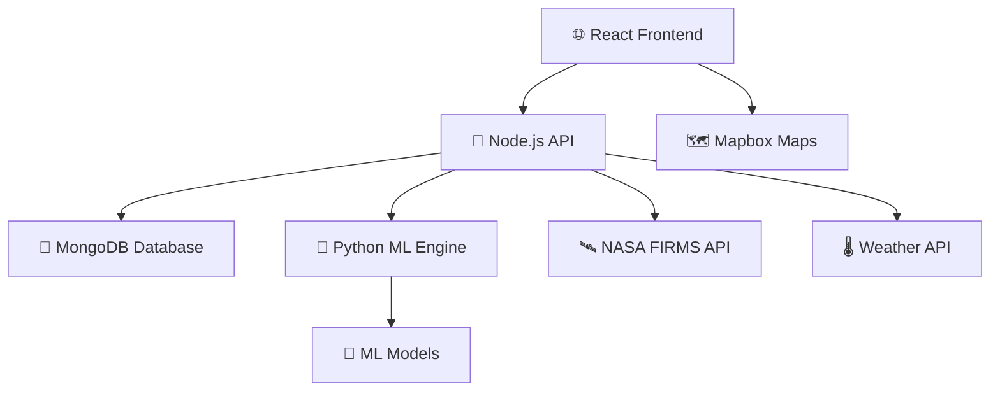

# 🔥 Ignis AI - Fire Prediction System

<div align="center">

[](https://ignis-ai-frontend.onrender.com/)
[](https://www.awesomescreenshot.com/video/39450246?key=5a62c83e79661779a9495f62051fc3ac)


</div>

---

## 🌟 Overview

**Ignis AI** is a cutting-edge fire prediction and visualization system that combines real-time satellite data, advanced machine learning, and interactive mapping to predict wildfire spread patterns. Built with modern web technologies and powered by NASA's FIRMS data, it provides critical insights for fire management and emergency response.

### ✨ Key Features

<table>
<tr>
<td width="50%">

🛰️ **Real-time Fire Detection**
- NASA FIRMS satellite integration
- Live fire data processing
- Automated data refresh

🎯 **AI-Powered Predictions**
- Advanced ML models (Gradient Boosting)
- Fire spread probability analysis
- Environmental factor consideration

</td>
<td width="50%">

🗺️ **Interactive Visualization**
- Mapbox integration with custom layers
- Dynamic fire markers and popups
- Spread pattern visualization

🌡️ **Weather Integration**
- Real-time weather data
- Wind pattern analysis
- Environmental monitoring

</td>
</tr>
</table>

---

## 🚀 Quick Start

### 📋 Prerequisites

Before you begin, ensure you have the following installed:

| Tool | Version | Purpose |
|------|---------|---------|
| 🟢 **Node.js** | v16.x - v18.x LTS | Backend API & Frontend |
| 🐍 **Python** | 3.11+ | ML Models & Data Processing |
| 🍃 **MongoDB** | 6.0+ | Database Storage |
| 📦 **npm** | v8+ | Package Management |
| 🔧 **Git** | Latest | Version Control |

### 🔑 Required API Keys

| Service | Purpose | How to Get |
|---------|---------|------------|
| 🗺️ **Mapbox** | Map visualization | [Get API Key](https://www.mapbox.com/) |
| 🛰️ **NASA FIRMS** | Fire data | [Get API Key](https://firms.modaps.eosdis.nasa.gov/) |
| 🍃 **MongoDB** | Database | [MongoDB Atlas](https://www.mongodb.com/cloud/atlas) |

---

## 🛠️ Installation & Setup

### 1️⃣ Clone the Repository

```bash
git clone https://github.com/MohitPatni0731/Fire-Prediction-system.git
cd Fire-Prediction-system
```

### 2️⃣ Backend Setup

<details>
<summary>📡 <strong>Backend Configuration</strong></summary>

#### Install Dependencies
```bash
cd backend
npm install
```

#### Environment Configuration
Create a `.env` file in the backend directory:

```env
# Server Configuration
PORT=5001

# Database
MONGODB_URI=your_mongodb_connection_string

# API Keys
NASA_API_KEY=your_nasa_firms_api_key
MAPBOX_ACCESS_TOKEN=your_mapbox_secret_token
```

#### Python ML Environment
```bash
cd ml
python3 -m venv venv
source venv/bin/activate  # On Windows: venv\Scripts\activate
pip install tensorflow scikit-learn pandas numpy joblib tqdm requests
```

#### Start Backend Server
```bash
npm start
```

✅ **Success Indicators:**
- `Server started on port 5001`
- `MongoDB connected successfully`

</details>

### 3️⃣ Frontend Setup

<details>
<summary>🎨 <strong>Frontend Configuration</strong></summary>

#### Install Dependencies
```bash
cd frontend
npm install
```

#### Environment Configuration
Create a `.env` file in the frontend directory:

```env
REACT_APP_MAPBOX_TOKEN=your_mapbox_public_token
REACT_APP_API_BASE_URL=http://localhost:5001/api
```

#### Start Frontend Application
```bash
npm start
```

🌐 **Access Application:** http://localhost:3000

</details>

---

## 🏗️ System Architecture

<div align="center">



</div>

### 📊 Data Flow

1. **📥 Data Ingestion** - NASA FIRMS satellite data collection
2. **🔄 Processing** - Real-time data parsing and storage
3. **🎯 Prediction** - ML models analyze fire spread probability
4. **🎨 Visualization** - Interactive map with prediction overlays
5. **📱 User Interface** - Responsive web application

---

## 🧠 Machine Learning Models

### 🎯 Dual Model Approach

| Model Type | Purpose | Algorithm |
|------------|---------|-----------|
| 🔍 **Classifier** | Spread Probability | Gradient Boosting Classifier |
| 📏 **Regressor** | Spread Distance | Gradient Boosting Regressor |

### 📈 Features Used

<div align="center">

| 🌍 Environmental | 🔥 Fire Data | 🌡️ Weather |
|------------------|--------------|-------------|
| Elevation | Brightness | Temperature |
| Terrain | Location | Humidity |
| Vegetation | Confidence | Wind Speed |
| Drought Index | Satellite Source | Wind Direction |

</div>

### 🎨 Prediction Visualization

- **🟢 Low Risk** (< 10%): Minimal spread indication
- **🟡 Medium Risk** (10-20%): Possible spread with basic visualization
- **🔴 High Risk** (≥ 20%): Full spread polygon with detailed analysis

---

## 📁 Project Structure

```
🔥 Fire-Prediction-System/
├── 📡 backend/
│   ├── 🧠 ml/                    # Python ML pipeline
│   │   ├── 📊 models/            # Trained ML models (.joblib)
│   │   ├── 🔮 predict_spread.py  # Prediction engine
│   │   └── 🏋️ training scripts   # Model training utilities
│   ├── 📋 models/                # Database schemas
│   ├── 🛣️ routes/                # API endpoints
│   ├── 🗄️ db.js                 # Database connection
│   └── 🚀 app.js                # Express server
├── 🎨 frontend/
│   └── 📱 src/
│       ├── 🗺️ components/        # React components
│       │   ├── MapComponent.jsx  # Interactive map
│       │   └── FireControls.js   # Control panel
│       ├── 🔌 api.js             # API integration
│       └── 📊 App.js             # Main application
└── 📖 README.md                  # This file
```

---

## 🎮 Usage Guide

### 🗺️ Map Interface

1. **🔍 View Fires** - Active fires appear as markers on the map
2. **📊 Filter Data** - Use controls to filter by brightness and confidence
3. **📍 Location Search** - Find fires near specific locations
4. **🎯 Predict Spread** - Click on fire markers to predict spread patterns

### 🎛️ Control Panel Features

- **🔄 Refresh Data** - Update with latest fire information
- **🎚️ Filters** - Brightness and confidence thresholds
- **📍 Location Tools** - GPS location and search functionality
- **📏 Range Selection** - Find fires within specified radius

---

## 🚨 Important Notes

> **⚠️ Render Deployment Notice**
> 
> The live demo uses Render's free tier, which may experience:
> - 🕒 **Cold Start Delays** - Initial load may take 10-30 seconds
> - 💤 **Sleep Mode** - Service sleeps after 15 minutes of inactivity

> **🎯 Prediction Performance**
> 
> - ML inference requires processing time
> - Real-time weather data fetching adds latency
> - Results appear automatically once processing completes

---

## 🔧 Development

### 🧪 Running Tests

```bash
# Backend tests
cd backend && npm test

# Frontend tests  
cd frontend && npm test
```

### 🏋️ Retraining Models

```bash
cd backend/ml
source venv/bin/activate
python process_data_dual.py       # Extract features
python train_classifier_advanced.py  # Train classifier
python train_regressor_advanced.py   # Train regressor
```

### 🐳 Docker Deployment

```bash
# Build and run with Docker
docker build -t ignis-ai .
docker run -p 5001:5001 ignis-ai
```

---

## 🤝 Contributing

We welcome contributions! Please follow these steps:

1. 🍴 Fork the repository
2. 🌿 Create a feature branch (`git checkout -b feature/amazing-feature`)
3. 💾 Commit your changes (`git commit -m 'Add amazing feature'`)
4. 📤 Push to the branch (`git push origin feature/amazing-feature`)
5. 🔄 Open a Pull Request

---

## 📄 License

This project is licensed under the MIT License - see the [LICENSE](LICENSE) file for details.

---

## 🙏 Acknowledgments

- 🛰️ **NASA FIRMS** - Fire data provision
- 🗺️ **Mapbox** - Mapping services
- 🌡️ **NOAA** - Weather data
- 🧠 **TensorFlow** - Machine learning framework
- ⚛️ **React Community** - Frontend framework

---

<div align="center">

### 🔥 Ready to Predict Fires? Get Started Now!

[](https://github.com/MohitPatni0731/Fire-Prediction-system.git)

**Made with ❤️ for wildfire prevention and safety**

</div>


