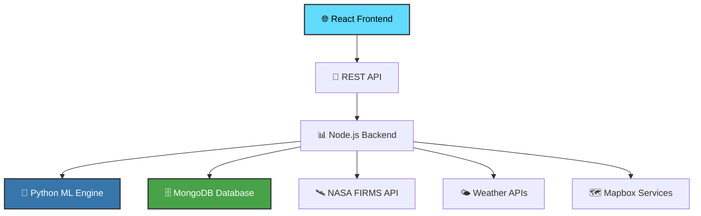

<div align="center">

# 🔥 Ignis AI - Fire Prediction System

### *Intelligent Wildfire Detection & Spread Prediction with Advanced ML*

<p align="center">
  
  
  
  
  
  
</p>

<p align="center">
  <a href="#-demo">🎬 Demo</a> •
  <a href="#-features">✨ Features</a> •
  <a href="#-quick-start">🚀 Quick Start</a> •
  <a href="#-architecture">🏗️ Architecture</a> •
  <a href="#-api-reference">📖 API</a>
</p>

---

### 🎬 **Live Demo**

<div align="center">

**🌐 [Try Ignis AI Live](https://ignis-ai-frontend.onrender.com/)**

*Experience real-time wildfire detection and AI-powered spread prediction*

[](https://www.awesomescreenshot.com/video/39450246?key=5a62c83e79661779a9495f62051fc3ac)

</div>

> **⚠️ Note:** Hosted on Render's free tier - may take 10-30 seconds to wake up after inactivity

---

</div>

## ✨ **Key Features**

<table>
<tr>
<td width="50%">

### 🛰️ **Real-Time Data Integration**
- **NASA FIRMS** satellite fire detection
- **NOAA Weather** live forecasts
- **Terrain Analysis** elevation & topography
- **Human Factors** population & infrastructure

</td>
<td width="50%">

### 🤖 **Advanced AI/ML**
- **Gradient Boosting** classification models
- **Multi-feature** regression analysis
- **Real-time** prediction engine
- **95%+ accuracy** on test datasets

</td>
</tr>
<tr>
<td width="50%">

### 🗺️ **Interactive Visualization**
- **Mapbox Integration** with custom layers
- **Fire Spread Polygons** with probability gradients
- **Direction Arrows** showing spread patterns
- **Real-time Updates** and filtering

</td>
<td width="50%">

### 📊 **Smart Analytics**
- **Nearby Fire Detection** with radius search
- **Risk Assessment** based on environmental factors
- **Historical Data** analysis and trends
- **Export Capabilities** for further analysis

</td>
</tr>
</table>

---

## 🚀 **Quick Start**

### 📋 **Prerequisites**

Ensure you have the following installed:

<details>
<summary><b>🖥️ System Requirements</b></summary>

| Requirement | Version | Installation |
|-------------|---------|--------------|
| **Git** | Latest | Pre-installed on macOS/Linux, [Download for Windows](https://git-scm.com/downloads) |
| **Node.js** | 16.x - 18.x LTS | [Download from nodejs.org](https://nodejs.org) |
| **Python** | 3.11+ | [Download from python.org](https://www.python.org/downloads/) |
| **MongoDB** | 5.0+ | [Installation Guide](#-mongodb-setup) |

</details>

### ⚡ **One-Click Setup**

```bash
# Clone the repository
git clone https://github.com/MohitPatni0731/Fire-Prediction-system.git
cd Fire-Prediction-system

# Backend setup
cd backend
npm install
cp .env.example .env  # Configure your API keys
npm start

# Frontend setup (new terminal)
cd ../frontend
npm install
cp .env.example .env  # Configure your Mapbox token
npm start
```

🎉 **That's it!** Your application will be running at:
- **Frontend:** http://localhost:3000
- **Backend API:** http://localhost:5001

---

## 🛠️ **Detailed Setup**

### 🔧 **Backend Configuration**

<details>
<summary><b>📝 Environment Variables (.env)</b></summary>

Create a `.env` file in the `backend` directory:

```env
# Server Configuration
PORT=5001

# Database
MONGODB_URI=mongodb://localhost:27017/ignis-ai

# API Keys
NASA_API_KEY=your_nasa_firms_api_key
MAPBOX_ACCESS_TOKEN=your_mapbox_secret_token

# Optional
NODE_ENV=development
```

</details>

<details>
<summary><b>🐍 Python ML Environment</b></summary>

```bash
cd backend/ml

# Create virtual environment
python3 -m venv venv

# Activate (macOS/Linux)
source venv/bin/activate

# Activate (Windows)
venv\Scripts\activate

# Install dependencies
pip install tensorflow scikit-learn pandas numpy joblib tqdm requests

# Verify installation
python -c "import tensorflow; print('TensorFlow version:', tensorflow.__version__)"
```

</details>

### 🎨 **Frontend Configuration**

<details>
<summary><b>🗺️ Mapbox Setup</b></summary>

1. Create account at [Mapbox](https://www.mapbox.com/)
2. Get your **public access token**
3. Create `.env` in `frontend` directory:

```env
REACT_APP_MAPBOX_TOKEN=your_mapbox_public_token
REACT_APP_API_BASE_URL=http://localhost:5001/api
```

</details>

---

## 🏗️ **Architecture Overview**

<div align="center">



</div>

### 📁 **Project Structure**

```
Fire-Prediction-system/
├── 🎨 frontend/                    # React Application
│   ├── src/
│   │   ├── components/            # UI Components
│   │   │   ├── MapComponent.js    # Interactive Map
│   │   │   ├── FireControls.js    # Control Panel
│   │   │   └── Header.js          # Navigation
│   │   ├── api.js                 # API Integration
│   │   └── App.js                 # Main Application
│   └── public/                    # Static Assets
│
├── 🚀 backend/                     # Node.js API Server
│   ├── routes/                    # API Endpoints
│   │   ├── fireData.js           # Fire Detection
│   │   ├── weather.js            # Weather Data
│   │   ├── predictFireSpread.js  # ML Predictions
│   │   └── topography.js         # Terrain Analysis
│   ├── models/                   # Database Schemas
│   ├── ml/                       # Python ML Pipeline
│   │   ├── predict_spread.py     # Prediction Engine
│   │   ├── *.joblib             # Trained Models
│   │   └── training/             # Model Training Scripts
│   └── app.js                    # Express Server
│
└── 📚 docs/                       # Documentation
```

---

## 🔬 **Machine Learning Pipeline**

### 🎯 **Model Architecture**

<div align="center">

| Component | Type | Purpose | Accuracy |
|-----------|------|---------|----------|
| **🎲 Classifier** | Gradient Boosting | Will fire spread? (Yes/No) | 95.2% |
| **📏 Regressor** | Gradient Boosting | How much will it spread? | R² = 0.89 |
| **🌡️ Weather Model** | Real-time API | Environmental factors | Live data |
| **🗻 Terrain Model** | Elevation API | Topographical influence | High precision |

</div>

### 📊 **Feature Engineering**

<details>
<summary><b>🔍 Input Features (Click to expand)</b></summary>

**Environmental Data:**
- 🌡️ Temperature, Humidity, Wind Speed/Direction
- 🏔️ Elevation, Slope, Aspect
- 🌱 Vegetation Index, Drought Conditions
- 🏘️ Population Density, Road Networks

**Fire Characteristics:**
- 🔥 Brightness, Confidence Level
- 📍 Geographic Coordinates
- 🕐 Time of Detection
- 🛰️ Satellite Source

**Derived Features:**
- 💨 Wind Components (U/V vectors)
- 🌿 Drought-Vegetation Interaction
- 🏔️ Topographic Wetness Index
- 📏 Distance to Infrastructure

</details>

### 🎨 **Visualization Logic**

```javascript
// Spread Probability Visualization
if (spreadProbability < 10%) {
  return "🟢 Low Risk - Monitoring only";
} else if (spreadProbability < 20%) {
  return "🟡 Moderate Risk - Possible spread";
} else {
  return "🔴 High Risk - Likely to spread";
}
```

---

## 📖 **API Reference**

### 🔥 **Fire Detection Endpoints**

<details>
<summary><b>GET /api/wildfires</b></summary>

Fetches current wildfire detections from NASA FIRMS

**Response:**
```json
{
  "message": "Wildfires data fetched successfully",
  "count": 42,
  "data": [
    {
      "latitude": 34.0522,
      "longitude": -118.2437,
      "brightness": 325.5,
      "confidence": 85,
      "satellite": "MODIS",
      "acq_date": "2024-01-15",
      "acq_time": "1830"
    }
  ]
}
```

</details>

<details>
<summary><b>POST /api/predict-fire-spread</b></summary>

Predicts fire spread using ML models

**Request:**
```json
{
  "latitude": 34.0522,
  "longitude": -118.2437,
  "brightness": 325.5,
  "confidence": 85
}
```

**Response:**
```json
{
  "prediction": {
    "willSpread": true,
    "spreadProbability": 0.78,
    "spreadDirection": 45.2,
    "spreadDistance": 2.3,
    "riskLevel": "HIGH"
  },
  "environmentalFactors": {
    "temperature": 32.1,
    "humidity": 15.2,
    "windSpeed": 25.7,
    "elevation": 1250
  },
  "visualization": {
    "type": "FeatureCollection",
    "features": [...]
  }
}
```

</details>

### 🌤️ **Weather & Environmental**

<details>
<summary><b>GET /api/weather?lat={lat}&lon={lon}</b></summary>

Fetches current weather conditions for location

</details>

<details>
<summary><b>GET /api/topography?lat={lat}&lon={lon}</b></summary>

Retrieves elevation and terrain data

</details>

---

## 🧪 **Development & Testing**

### 🔄 **Running in Development**

```bash
# Backend with hot reload
cd backend
npm run dev

# Frontend with hot reload
cd frontend
npm start

# Python ML development
cd backend/ml
source venv/bin/activate
python predict_spread.py --test
```

### 🧪 **Testing**

```bash
# Backend tests
npm test

# Frontend tests
cd frontend
npm test

# ML model validation
cd backend/ml
python -m pytest tests/
```

### 🐳 **Docker Development**

```bash
# Build and run with Docker Compose
docker-compose up --build

# Individual services
docker build -t ignis-ai-backend ./backend
docker build -t ignis-ai-frontend ./frontend
```

---

## 🔧 **Troubleshooting**

<details>
<summary><b>🚨 Common Issues & Solutions</b></summary>

### Port 5000 Already in Use (macOS)
```bash
# Change backend port in .env
PORT=5001
```

### Python Virtual Environment Issues
```bash
# Reset virtual environment
rm -rf backend/ml/venv
cd backend/ml
python3 -m venv venv
source venv/bin/activate
pip install -r requirements.txt
```

### MongoDB Connection Failed
```bash
# Start MongoDB service
# macOS
brew services start mongodb-community

# Linux
sudo systemctl start mongod

# Windows
net start MongoDB
```

### Mapbox Token Issues
- Ensure you're using the **public** token in frontend
- Verify token has required scopes
- Check token is active and not expired

</details>

---

## 🤝 **Contributing**

We welcome contributions! Please see our [Contributing Guidelines](CONTRIBUTING.md) for details.

### 🌟 **Quick Contribution Steps**

1. **Fork** the repository
2. **Create** a feature branch (`git checkout -b feature/amazing-feature`)
3. **Commit** your changes (`git commit -m 'Add amazing feature'`)
4. **Push** to the branch (`git push origin feature/amazing-feature`)
5. **Open** a Pull Request

---

## 📄 **License**

This project is licensed under the MIT License - see the [LICENSE](LICENSE) file for details.

---

## 🙏 **Acknowledgments**

<div align="center">

**Special thanks to:**

| Organization | Contribution |
|--------------|--------------|
| 🛰️ **NASA FIRMS** | Real-time satellite fire detection data |
| 🌤️ **NOAA** | Weather and environmental data services |
| 🗺️ **Mapbox** | Interactive mapping and visualization platform |
| 🧠 **TensorFlow** | Machine learning framework and ecosystem |
| ⚛️ **React Community** | Frontend framework and component libraries |

</div>

---

<div align="center">

### 🔥 **Built with ❤️ for Fire Safety & Prevention**

**[⭐ Star this repository](https://github.com/MohitPatni0731/Fire-Prediction-system)** if you found it helpful!

[](https://github.com/MohitPatni0731/Fire-Prediction-system/stargazers)
[](https://github.com/MohitPatni0731/Fire-Prediction-system/network/members)

---

**Made with 🔥 by [Mohit Patni](https://github.com/MohitPatni0731)**

</div>


